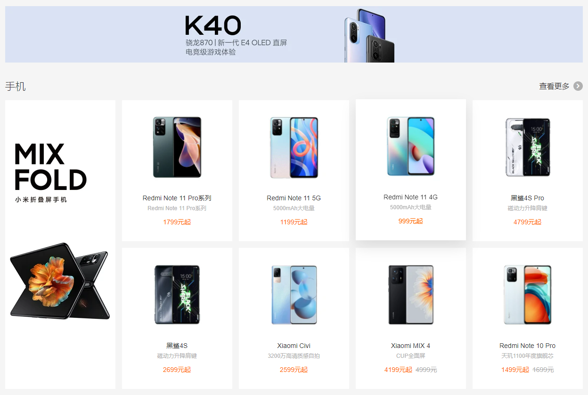

<div style="text-align:left;">
   
</div>

# 阶段项目：小米商城

**主要内容**

* 头部
* 导航
* banner
* 广告部分
* 手机部分
* 家电部分
* 视频部分
* 页脚

**学习目标**

| 知识点   | 要求 |
| -------- | ---- |
| 头部     | 掌握 |
| 导航     | 掌握 |
| banner   | 掌握 |
| 广告部分 | 掌握 |
| 手机部分 | 掌握 |
| 家电部分 | 掌握 |
| 视频部分 | 掌握 |
| 页脚     | 掌握 |

## 一、头部

### 1. 头部

<div style="text-align:left;">
    
</div>

```html
<!--头部开始-->
<div class="header">
    <div class="wrap">
        <ul class="header-left">
            <li><a href="#">小米商城</a><span>|</span></li>
            <li><a href="#">MIUI</a><span>|</span></li>
            <li><a href="#">loT</a><span>|</span></li>
            <li><a href="#">云服务</a><span>|</span></li>
            <li><a href="#">天星数科</a><span>|</span></li>
            <li><a href="#">有品</a><span>|</span></li>
            <li><a href="#">小爱开放平台</a><span>|</span></li>
            <li><a href="#">企业团购</a><span>|</span></li>
            <li><a href="#">资质证照</a><span>|</span></li>
            <li><a href="#">协议规则</a><span>|</span></li>
            <li>
                <a href="#">下载app</a><span>|</span>
                <div class="download">
                    <a href="#">
                        
                        <p>小米商城APP</p>
                    </a>
                </div>
                <div class="triangle"></div>
            </li>
            <li><a href="#">智能生活</a><span>|</span></li>
            <li><a href="#">Select Location</a></li>
        </ul>
        <ul class="header-right">
            <li><a href="#">登录</a><span>|</span></li>
            <li><a href="#">注册</a><span>|</span></li>
            <li><a href="#">消息通知</a></li>
            <li class="cart">
                <a href="#">
                    <i class="iconfont"></i>购物车(0)
                </a>
                <div class="cart-list">
                    购物车中还没有商品，赶紧选购吧！
                </div>
            </li>
        </ul>
    </div>
</div>
<!--头部结束-->
```

```css
/*头部样式开始*/
.header {
    width: 100%;
    height: 40px;
    line-height: 40px;
    background-color: #333;
    font-size: 12px;
}

.wrap {
    width: 1226px;
    margin: 0 auto;
}

.header-left {
    float: left;
}

.header-right {
    float: right;
}

.header li {
    position: relative;
    float: left;
}

.header a {
    color: #b0b0b0;
}

.header a:hover {
    color: #fff;
}

.header span {
    color: #424242;
    margin: 0 6px;
}

/*购物车*/
.cart {
    position: relative;
    width: 120px;
    height: 40px;
    background-color: #424242;
    margin-left: 25px;
    cursor: pointer;
}

.cart i {
    margin-right: 4px;
}

.cart:hover {
    background-color: #fff;
}

/*鼠标悬停在li上 里面的a字体颜色变为橘色*/
.cart:hover > a {
    color: #ff6700;
}

.cart-list {
    z-index: 850;
    position: absolute;
    top: 40px;
    right: 0;
    width: 316px;
    /*元素高度设置为0*/
    height: 0;
    /*元素中的内容溢出*/
    overflow: hidden;
    line-height: 100px;
    background-color: #fff;
    box-shadow: 0 2px 10px rgba(0, 0, 0, .15);
    transition: all .3s;
}

.cart:hover > .cart-list {
    height: 100px;
}

/*下载app*/
.download {
    z-index: 800;
    position: absolute;
    top: 40px;
    /*水平居中*/
    left: 50%;
    margin-left: -62px;
    width: 124px;
    height: 0;
    overflow: hidden;
    background-color: #fff;
    box-shadow: 0 1px 5px #aaa;
    transition: all .3s;
}

.download img {
    width: 90px;
    margin: 18px 0 12px;
}

.download > a {
    display: block;
}

.download p {
    color: #333;
    font-size: 14px;
    line-height: 14px;
}

.header-left > li:hover > .download {
    height: 148px;
}

/*绘制三角形*/
.triangle {
    display: none;
    position: absolute;
    bottom: 0;
    left: 50%;
    margin-left: -8px;
    width: 0;
    height: 0;
    border-bottom: 8px solid #fff;
    border-left: 8px solid transparent;
    border-right: 8px solid transparent;
}

.header-left > li:hover > .triangle {
    display: block;
}

/*头部样式结束*/
```

## 二、导航

### 1. 导航

<div style="text-align:left;">
    
</div>

```html
<!--导航开始-->
<div class="nav">
    <div class="wrap">
        <div class="logo">
            <a href="#">
                
            </a>
        </div>
        <div class="nav-bar">
            <ul>
                <li>
                    <a href="#">小米手机</a>
                    <div class="nav-bar-list">
                        <div class="wrap">
                            <ul>
                                <li>
                                    <a href="#">
                                        <div class="nav-img-box">
                                            
                                        </div>
                                        <p>Xiaomi Civi</p>
                                        <p>2599元起</p>
                                    </a>
                                </li>
                                <li>
                                    <a href="#">
                                        <div class="nav-img-box">
                                            
                                        </div>
                                        <p>Xiaomi Civi</p>
                                        <p>2599元起</p>
                                    </a>
                                </li>
                                <li>
                                    <a href="#">
                                        <div class="nav-img-box">
                                            
                                        </div>
                                        <p>Xiaomi Civi</p>
                                        <p>2599元起</p>
                                    </a>
                                </li>
                                <li>
                                    <a href="#">
                                        <div class="nav-img-box">
                                            
                                        </div>
                                        <p>Xiaomi Civi</p>
                                        <p>2599元起</p>
                                    </a>
                                </li>
                                <li>
                                    <a href="#">
                                        <div class="nav-img-box">
                                            
                                        </div>
                                        <p>Xiaomi Civi</p>
                                        <p>2599元起</p>
                                    </a>
                                </li>
                                <li>
                                    <a href="#">
                                        <div class="nav-img-box">
                                            
                                        </div>
                                        <p>Xiaomi Civi</p>
                                        <p>2599元起</p>
                                    </a>
                                </li>
                            </ul>
                        </div>
                    </div>
                </li>
                <li>
                    <a href="#">Redmi 红米</a>
                    <div class="nav-bar-list">
                        <div class="wrap">
                            <ul>
                                <li>
                                    <a href="#">
                                        <div class="nav-img-box">
                                            
                                        </div>
                                        <p>Xiaomi Civi</p>
                                        <p>2599元起</p>
                                    </a>
                                </li>
                                <li>
                                    <a href="#">
                                        <div class="nav-img-box">
                                            
                                        </div>
                                        <p>Xiaomi Civi</p>
                                        <p>2599元起</p>
                                    </a>
                                </li>
                                <li>
                                    <a href="#">
                                        <div class="nav-img-box">
                                            
                                        </div>
                                        <p>Xiaomi Civi</p>
                                        <p>2599元起</p>
                                    </a>
                                </li>
                                <li>
                                    <a href="#">
                                        <div class="nav-img-box">
                                            
                                        </div>
                                        <p>Xiaomi Civi</p>
                                        <p>2599元起</p>
                                    </a>
                                </li>
                                <li>
                                    <a href="#">
                                        <div class="nav-img-box">
                                            
                                        </div>
                                        <p>Xiaomi Civi</p>
                                        <p>2599元起</p>
                                    </a>
                                </li>
                                <li>
                                    <a href="#">
                                        <div class="nav-img-box">
                                            
                                        </div>
                                        <p>Xiaomi Civi</p>
                                        <p>2599元起</p>
                                    </a>
                                </li>
                            </ul>
                        </div>
                    </div>
                </li>
                <li><a href="#">电视</a></li>
                <li><a href="#">笔记本</a></li>
                <li><a href="#">平板</a></li>
                <li><a href="#">家电</a></li>
                <li><a href="#">路由器</a></li>
                <li><a href="#">智能硬件</a></li>
                <li><a href="#">服务</a></li>
                <li><a href="#">社区</a></li>
            </ul>
        </div>
        <div class="search">
            <input type="text" placeholder="小米手机">
            <button type="button" class="iconfont"></button>
            <div class="search-list">
                <a href="#">小米手机</a>
                <a href="#">小米手机</a>
                <a href="#">小米手机</a>
                <a href="#">小米手机</a>
                <a href="#">小米手机</a>
                <a href="#">小米手机</a>
                <a href="#">小米手机</a>
                <a href="#">小米手机</a>
            </div>
        </div>
    </div>
</div>
<!--导航结束-->
```

```css
/*导航样式开始*/
.nav {
    position: relative;
    width: 100%;
    height: 100px;
    background-color: #fff;
}

.logo {
    margin-top: 22px;
    float: left;
    width: 56px;
    height: 56px;
}

.nav-bar {
    float: left;
    width: 874px;
    height: 100px;
    line-height: 100px;
    padding-left: 172px;
    box-sizing: border-box;
}

.search {
    position: relative;
    float: left;
    width: 296px;
    height: 50px;
    margin-top: 25px;
}

.logo img {
    width: 100%;
}

.nav-bar > ul > li {
    float: left;
    padding: 0 10px;
}

.nav-bar > ul > li > a:hover {
    color: #ff6700;
}

/*下拉列表*/
.nav-bar-list {
    z-index: 750;
    display: none;
    position: absolute;
    left: 0;
    top: 100px;
    width: 100%;
    height: 229px;
    background-color: #fff;
    border-top: 1px solid #e0e0e0;
    box-shadow: 0 3px 4px rgba(0, 0, 0, .18);
}

.nav-bar li:hover > .nav-bar-list {
    display: block;
}

/*下拉列表的内容*/
.nav-bar-list li {
    float: left;
    width: 204px;
    padding-top: 35px;
}

.nav-img-box {
    width: 100%;
    height: 110px;
    border-right: 1px solid #e0e0e0;
    box-sizing: border-box;
    margin-bottom: 20px;
}

.nav-bar-list p {
    font-size: 12px;
    line-height: 20px;
}

.nav-bar-list p:nth-of-type(2) {
    color: #ff6700;
}

.nav-bar-list li:last-child .nav-img-box {
    border-right: none;
}

/*搜索框*/
.search > input {
    float: left;
    width: 223px;
    height: 48px;
    padding: 0 10px;
    border: 1px solid #e0e0e0;
    border-right: none;
    /*去掉input点击时黑色的边框*/
    outline: none;
    transition: all .2s;
}

.search > button {
    float: left;
    width: 52px;
    height: 50px;
    background-color: #fff;
    border: 1px solid #e0e0e0;
    font-size: 24px;
    transition: all .2s;
}

.search > button:hover {
    background-color: #ff6700;
    border-color: #ff6700;
    color: #fff;
}

.search > input:hover, .search > input:hover + button {
    border-color: #b0b0b0;
}

.search > input:focus, .search > input:focus + button {
    border-color: #ff6700;
}

.search-list {
    display: none;
    z-index: 720;
    position: absolute;
    top: 50px;
    left: 0;
    width: 243px;
    height: 240px;
    background-color: #fff;
    border: 1px solid #ff6700;
    border-top: none;
}

.search > input:focus ~ .search-list {
    display: block;
}

.search-list > a {
    display: block;
    width: 100%;
    height: 30px;
    padding: 6px 15px;
    box-sizing: border-box;
    text-align: left;
}

.search-list > a:hover {
    background-color: #fafafa;
}

/*导航样式结束*/
```

## 三、banner

### 1. banner

<div style="text-align:left;">
    
    
</div>

```html
<div class="banner">
    <div class="wrap">
        <div class="banner-box">
            
            <div class="slide">
                <ul>
                    <li>
                        <a href="#">手机</a><i class="iconfont"></i>
                        <div class="slide-list">
                            <ul>
                                <li>
                                    <a href="#">
                                        
                                        <span>Xiaomi Civi</span>
                                    </a>
                                </li>
                                <li>
                                    <a href="#">
                                        
                                        <span>Xiaomi Civi</span>
                                    </a>
                                </li>
                                <li>
                                    <a href="#">
                                        
                                        <span>Xiaomi Civi</span>
                                    </a>
                                </li>
                                <li>
                                    <a href="#">
                                        
                                        <span>Xiaomi Civi</span>
                                    </a>
                                </li>
                                <li>
                                    <a href="#">
                                        
                                        <span>Xiaomi Civi</span>
                                    </a>
                                </li>
                                <li>
                                    <a href="#">
                                        
                                        <span>Xiaomi Civi</span>
                                    </a>
                                </li>
                            </ul>
                            <ul>
                                <li>
                                    <a href="#">
                                        
                                        <span>Xiaomi Civi</span>
                                    </a>
                                </li>
                                <li>
                                    <a href="#">
                                        
                                        <span>Xiaomi Civi</span>
                                    </a>
                                </li>
                                <li>
                                    <a href="#">
                                        
                                        <span>Xiaomi Civi</span>
                                    </a>
                                </li>
                                <li>
                                    <a href="#">
                                        
                                        <span>Xiaomi Civi</span>
                                    </a>
                                </li>
                                <li>
                                    <a href="#">
                                        
                                        <span>Xiaomi Civi</span>
                                    </a>
                                </li>
                                <li>
                                    <a href="#">
                                        
                                        <span>Xiaomi Civi</span>
                                    </a>
                                </li>
                            </ul>
                            <ul>
                                <li>
                                    <a href="#">
                                        
                                        <span>Xiaomi Civi</span>
                                    </a>
                                </li>
                                <li>
                                    <a href="#">
                                        
                                        <span>Xiaomi Civi</span>
                                    </a>
                                </li>
                                <li>
                                    <a href="#">
                                        
                                        <span>Xiaomi Civi</span>
                                    </a>
                                </li>
                                <li>
                                    <a href="#">
                                        
                                        <span>Xiaomi Civi</span>
                                    </a>
                                </li>
                                <li>
                                    <a href="#">
                                        
                                        <span>Xiaomi Civi</span>
                                    </a>
                                </li>
                                <li>
                                    <a href="#">
                                        
                                        <span>Xiaomi Civi</span>
                                    </a>
                                </li>
                            </ul>
                            <ul>
                                <li>
                                    <a href="#">
                                        
                                        <span>Xiaomi Civi</span>
                                    </a>
                                </li>
                                <li>
                                    <a href="#">
                                        
                                        <span>Xiaomi Civi</span>
                                    </a>
                                </li>
                                <li>
                                    <a href="#">
                                        
                                        <span>Xiaomi Civi</span>
                                    </a>
                                </li>
                                <li>
                                    <a href="#">
                                        
                                        <span>Xiaomi Civi</span>
                                    </a>
                                </li>
                                <li>
                                    <a href="#">
                                        
                                        <span>Xiaomi Civi</span>
                                    </a>
                                </li>
                                <li>
                                    <a href="#">
                                        
                                        <span>Xiaomi Civi</span>
                                    </a>
                                </li>
                            </ul>

                        </div>
                    </li>
                    <li>
                        <a href="#">电视</a><i class="iconfont"></i>
                    </li>
                    <li>
                        <a href="#">出行 穿戴</a><i class="iconfont"></i>
                        <div class="slide-list slide-list1">
                            <ul>
                                <li>
                                    <a href="#">
                                        
                                        <span>Xiaomi Civi</span>
                                    </a>
                                </li>
                                <li>
                                    <a href="#">
                                        
                                        <span>Xiaomi Civi</span>
                                    </a>
                                </li>
                                <li>
                                    <a href="#">
                                        
                                        <span>Xiaomi Civi</span>
                                    </a>
                                </li>
                                <li>
                                    <a href="#">
                                        
                                        <span>Xiaomi Civi</span>
                                    </a>
                                </li>
                                <li>
                                    <a href="#">
                                        
                                        <span>Xiaomi Civi</span>
                                    </a>
                                </li>
                                <li>
                                    <a href="#">
                                        
                                        <span>Xiaomi Civi</span>
                                    </a>
                                </li>
                            </ul>
                            <ul>
                                <li>
                                    <a href="#">
                                        
                                        <span>Xiaomi Civi</span>
                                    </a>
                                </li>
                                <li>
                                    <a href="#">
                                        
                                        <span>Xiaomi Civi</span>
                                    </a>
                                </li>
                                <li>
                                    <a href="#">
                                        
                                        <span>Xiaomi Civi</span>
                                    </a>
                                </li>
                                <li>
                                    <a href="#">
                                        
                                        <span>Xiaomi Civi</span>
                                    </a>
                                </li>
                                <li>
                                    <a href="#">
                                        
                                        <span>Xiaomi Civi</span>
                                    </a>
                                </li>
                                <li>
                                    <a href="#">
                                        
                                        <span>Xiaomi Civi</span>
                                    </a>
                                </li>
                            </ul>
                            <ul>
                                <li>
                                    <a href="#">
                                        
                                        <span>Xiaomi Civi</span>
                                    </a>
                                </li>
                            </ul>
                        </div>
                    </li>
                    <li><a href="#">手机</a><i class="iconfont"></i></li>
                    <li><a href="#">手机</a><i class="iconfont"></i></li>
                    <li><a href="#">手机</a><i class="iconfont"></i></li>
                    <li><a href="#">手机</a><i class="iconfont"></i></li>
                    <li><a href="#">手机</a><i class="iconfont"></i></li>
                    <li><a href="#">手机</a><i class="iconfont"></i></li>
                    <li><a href="#">手机</a><i class="iconfont"></i></li>
                </ul>
            </div>
        </div>
    </div>
</div>
```

```css
/*banner样式开始*/
.banner, .banner-box {
    width: 100%;
    height: 460px;
}

.banner-box > img {
    width: 100%;
}

/*滑动门*/
.banner-box {
    position: relative;
}

.slide {
    position: absolute;
    top: 0;
    left: 0;
    width: 234px;
    height: 420px;
    background-color: rgba(105, 101, 101, .6);
    padding: 20px 0;
}

.slide > ul > li {
    height: 42px;
    line-height: 42px;
    text-align: left;
    padding-left: 30px;
}

.slide > ul > li:hover {
    background-color: #ff6700;
}

.slide i {
    float: right;
    margin-right: 20px;
    color: #fff;
}

.slide > ul > li > a {
    color: #fff;
    font-size: 14px;
}

.slide-list {
    display: none;
    position: absolute;
    top: 0;
    left: 234px;
    width: 992px;
    height: 456px;
    background-color: #fff;
    border: 1px solid #e0e0e0;
    padding-top: 2px;
    border-left: none;
    box-shadow: 0 8px 16px rgba(0, 0, 0, .18);
}

.slide > ul > li:hover > .slide-list {
    display: block;
}

.slide-list > ul {
    width: 248px;
    float: left;
}

.slide-list li {
    width: 100%;
    height: 76px;
    padding: 20px 0 20px 18px;
    box-sizing: border-box;
}

.slide-list img {
    margin-right: 12px;
}

.slide-list span {
    font-size: 14px;
}

.slide-list li:hover span {
    color: #ff6700;
}

.slide-list1 {
    width: 744px;
}

/*banner样式结束*/
```

## 四、广告部分

### 1. 广告部分

<div style="text-align:left;">
    
</div>

```html
<!--广告开始-->
<div class="adv">
    <div class="wrap">
        <div class="adv-aside">
            <ul>
                <li class="row col"><a href="#"><i class="iconfont"></i>
                    <p>米粉卡</p></a></li>
                <li class="row col"><a href="#"><i class="iconfont"></i>
                    <p>米粉卡</p></a></li>
                <li class="row"><a href="#"><i class="iconfont"></i>
                    <p>米粉卡</p></a></li>
                <li class="col"><a href="#"><i class="iconfont"></i>
                    <p>米粉卡</p></a></li>
                <li class="col"><a href="#"><i class="iconfont"></i>
                    <p>米粉卡</p></a></li>
                <li><a href="#"><i class="iconfont"></i>
                    <p>米粉卡</p></a></li>
            </ul>
        </div>
        <div class="adv-img">
            <a href="#"></a>
        </div>
        <div class="adv-img">
            <a href="#"></a>
        </div>
        <div class="adv-img">
            <a href="#"></a>
        </div>
    </div>
</div>
<!--广告结束-->
```

```css
/*广告样式开始*/
.adv {
    width: 100%;
    height: 170px;
    background-color: #fff;
    margin: 14px 0 26px;
}

.adv-aside {
    float: left;
    width: 228px;
    height: 164px;
    padding: 3px;
    background-color: #5f5750;
}

.adv-img {
    float: left;
    width: 316px;
    height: 170px;
    margin-left: 14.66px;
    transition: all .2s linear;
}

.adv-img:hover {
    box-shadow: 0 15px 30px rgba(0, 0, 0, .1);
}

.adv-img img {
    width: 100%;
}

.adv-aside li {
    position: relative;
    float: left;
    width: 76px;
    height: 82px;
}

.adv-aside a {
    display: block;
    color: #fff;
    opacity: .7;
    font-size: 12px;
    transition: all .2s;
}

.adv-aside a:hover {
    opacity: 1;
}

.adv-aside i {
    font-size: 24px;
    /*行内元素设置margin和padding的上下不生效*/
    margin-bottom: 4px;
    display: block;
    margin-top: 18px;
}

.row::after, .col::before {
    position: absolute;
    content: "";
    background-color: #665e57;
}

.row::after {
    bottom: 0;
    left: 6px;
    width: 64px;
    height: 1px;

}

.col::before {
    right: 0;
    top: 6px;
    width: 1px;
    height: 70px;
}

/*广告样式结束*/
```

## 五、手机部分

### 1. 手机部分

<div style="text-align:left;">
    
</div>

```html
        <!--手机开始-->
        <div class="phone">
            <div class="home-banner-box">
                <a href="#">
                    
                </a>
            </div>
            <h2 class="title">
                手机
                <a href="#" class="more">查看更多 <i class="iconfont"></i></a>
            </h2>
            <div class="phone-box">
                <div class="phone-box-left">
                    <a href="#">
                        
                    </a>
                </div>
                <div class="phone-box-right">
                    <ul>
                        <li class="items">
                            <a href="#">
                                
                                <p class="goods-name">Xiaomi Civi </p>
                                <p class="goods-desc">Xiaomi Civi</p>
                                <p class="goods-price">2599元起</p>
                            </a>
                        </li>
                        <li class="items">
                            <a href="#">
                                
                                <p class="goods-name">Xiaomi Civi </p>
                                <p class="goods-desc">Xiaomi Civi</p>
                                <p class="goods-price">2599元起</p>
                            </a>
                        </li>
                        <li class="items">
                            <a href="#">
                                
                                <p class="goods-name">Xiaomi Civi </p>
                                <p class="goods-desc">Xiaomi Civi</p>
                                <p class="goods-price">2599元起</p>
                            </a>
                        </li>
                        <li class="items">
                            <a href="#">
                                
                                <p class="goods-name">Xiaomi Civi </p>
                                <p class="goods-desc">Xiaomi Civi</p>
                                <p class="goods-price">2599元起</p>
                            </a>
                        </li>
                        <li class="items">
                            <a href="#">
                                
                                <p class="goods-name">Xiaomi Civi </p>
                                <p class="goods-desc">Xiaomi Civi</p>
                                <p class="goods-price">2599元起</p>
                            </a>
                        </li>
                        <li class="items">
                            <a href="#">
                                
                                <p class="goods-name">Xiaomi Civi </p>
                                <p class="goods-desc">Xiaomi Civi</p>
                                <p class="goods-price">2599元起</p>
                            </a>
                        </li>
                        <li class="items">
                            <a href="#">
                                
                                <p class="goods-name">Xiaomi Civi </p>
                                <p class="goods-desc">Xiaomi Civi</p>
                                <p class="goods-price">2599元起</p>
                            </a>
                        </li>
                        <li class="items">
                            <a href="#">
                                
                                <p class="goods-name">Xiaomi Civi </p>
                                <p class="goods-desc">Xiaomi Civi</p>
                                <p class="goods-price">2599元起</p>
                            </a>
                        </li>
                    </ul>
                </div>
            </div>
        </div>
        <!--手机结束-->
```

```css
/*手机样式开始*/
.home-banner-box {
    width: 100%;
    height: 120px;
    margin: 22px 0;
}

.title {
    color: #333;
    font-size: 22px;
    font-weight: 200;
    text-align: left;
    line-height: 58px;
}

.more {
    float: right;
    color: #424242;
    font-size: 16px;
    transition: all .4s;
}

.more > i {
    display: inline-block;
    width: 20px;
    height: 22px;
    background-color: #b0b0b0;
    border-radius: 50%;
    text-align: center;
    line-height: 22px;
    color: #fff;
    font-size: 12px;
    transition: all .4s;
}

.more:hover {
    color: #ff6700;
}

.more:hover > i {
    background-color: #ff6700;
}

.phone-box {
    width: 100%;
    height: 614px;
}

.phone-box-left {
    float: left;
    width: 234px;
    height: 614px;
    transition: all .2s linear;
}

.phone-box-right,.ele-right {
    float: left;
    width: 992px;
    height: 614px;
}

.items {
    float: left;
    width: 234px;
    height: 300px;
    background-color: #fff;
    margin-bottom: 14px;
    margin-left: 14px;
    transition: all .2s linear;
}

.items:hover, .phone-box-left:hover,.items1 div:hover,.video-box li:hover {
    transform: translateY(-2px);
    box-shadow: 0 15px 30px rgba(0, 0, 0, .1);
}

.goods-img {
    width: 160px;
    margin-top: 20px;
    margin-bottom: 18px;
}

.goods-name, .goods-desc {
    width: 214px;
    margin: 0 auto;
    white-space: nowrap;
    overflow: hidden;
    text-overflow: ellipsis;
}

.goods-name {
    height: 21px;
    margin-bottom: 2px;
    font-size: 14px;
}

.goods-desc {
    height: 18px;
    margin-bottom: 10px;
    font-size: 12px;
    color: #b0b0b0;
}

.goods-price {
    color: #ff6700;
    font-size: 14px;
}

/*手机样式结束*/
```

## 六、家电部分

### 1. 家电部分

<div style="text-align:left;">
    
</div>

```html
        <!--家电开始-->
        <div class="elc">
            <h2 class="title">家电</h2>
            <div class="ele-box clear">
                <div class="ele-left">
                    <ul>
                        <li class="items"><a href="#"></a>
                        </li>
                        <li class="items"><a href="#"></a>
                        </li>
                    </ul>
                </div>
                <div class="ele-right">
                    <ul>
                        <li class="items">
                            <a href="#">
                                
                                <p class="goods-name">小米电视4A 70英寸 </p>
                                <p class="goods-desc">大屏更享受大屏更享受大屏更享受</p>
                                <p class="goods-price">3299元
                                    <del>3999元</del>
                                </p>
                            </a>
                        </li>
                        <li class="items">
                            <a href="#">
                                
                                <p class="goods-name">小米电视4A 70英寸 </p>
                                <p class="goods-desc">大屏更享受大屏更享受大屏更享受</p>
                                <p class="goods-price">3299元
                                    <del>3999元</del>
                                </p>
                            </a>
                        </li>
                        <li class="items">
                            <a href="#">
                                
                                <p class="goods-name">小米电视4A 70英寸 </p>
                                <p class="goods-desc">大屏更享受大屏更享受大屏更享受</p>
                                <p class="goods-price">3299元
                                    <del>3999元</del>
                                </p>
                            </a>
                        </li>
                        <li class="items">
                            <a href="#">
                                
                                <p class="goods-name">小米电视4A 70英寸 </p>
                                <p class="goods-desc">大屏更享受大屏更享受大屏更享受</p>
                                <p class="goods-price">3299元
                                    <del>3999元</del>
                                </p>
                            </a>
                        </li>
                        <li class="items">
                            <a href="#">
                                
                                <p class="goods-name">小米电视4A 70英寸 </p>
                                <p class="goods-desc">大屏更享受大屏更享受大屏更享受</p>
                                <p class="goods-price">3299元
                                    <del>3999元</del>
                                </p>
                            </a>
                        </li>
                        <li class="items">
                            <a href="#">
                                
                                <p class="goods-name">小米电视4A 70英寸 </p>
                                <p class="goods-desc">大屏更享受大屏更享受大屏更享受</p>
                                <p class="goods-price">3299元
                                    <del>3999元</del>
                                </p>
                            </a>
                        </li>
                        <li class="items">
                            <a href="#">
                                
                                <p class="goods-name">小米电视4A 70英寸 </p>
                                <p class="goods-desc">大屏更享受大屏更享受大屏更享受</p>
                                <p class="goods-price">3299元
                                    <del>3999元</del>
                                </p>
                            </a>
                        </li>
                        <li class="items1">
                            <div>
                                <a href="#">
                                    <p class="items1-desc">
                                        <span>Redmi MAX 86″ 超大屏电视 </span>
                                        <br>
                                        <span class="items1-price">7999元</span>
                                    </p>
                                    
                                </a>
                            </div>
                            <div></div>
                        </li>
                    </ul>
                </div>
            </div>
        </div>
        <!--家电结束-->
```

```css
/*家电样式开始*/
.ele-left{
    float: left;
    width: 234px;
    height: 614px;
}
.ele-left .items{
    margin-left: 0;
}
.goods-price>del{
    color: #b0b0b0;
    margin-left: 7px;
}
.items1{
    width: 234px;
    height: 300px;
    float: left;
    margin-left: 14px;
}
.items1 div{
    width: 234px;
    height: 143px;
    background-color: #fff;
    margin-bottom: 14px;
    transition: all .2s linear;
}
.items1-desc {
    float: left;
    width: 94px;
    height: 63px;
    margin-left: 30px;
    margin-top: 40px;
    font-size: 14px;
    text-align: left;
}
.items1-img{
    float: right;
    width: 80px;
    margin-top: 32px;
    margin-right: 20px;
}
.items1-price{
    color: #ff6700;
    font-size: 12px;
}
/*家电样式结束*/
```

## 七、视频部分

### 1. 视频部分

<div style="text-align:left;">
    
</div>

```html
        <!--视频开始-->
        <div class="video">
            <h2 class="title">
                视频
                <a href="#" class="more">查看全部 <i class="iconfont"></i></a>
            </h2>
            <div class="video-box clear">
                <ul>
                    <li>
                        <a href="#">
                            <div class="video-img">
                                
                                <div class="play">
                                    <div></div>
                                </div>
                            </div>
                            <p class="video-name">2021年春季新品发布会第一场 </p>
                        </a>
                    </li>
                    <li>
                        <a href="#">
                            <div class="video-img">
                                
                                <div class="play">
                                    <div></div>
                                </div>
                            </div>
                            <p class="video-name">2021年春季新品发布会第一场 </p>
                        </a>
                    </li>
                    <li>
                        <a href="#">
                            <div class="video-img">
                                
                                <div class="play">
                                    <div></div>
                                </div>
                            </div>
                            <p class="video-name">2021年春季新品发布会第一场 </p>
                        </a>
                    </li>
                    <li>
                        <a href="#">
                            <div class="video-img">
                                
                                <div class="play">
                                    <div></div>
                                </div>
                            </div>
                            <p class="video-name">2021年春季新品发布会第一场 </p>
                        </a>
                    </li>
                </ul>
            </div>
        </div>
        <!-- 视频结束-->
```

```css
/*视频样式开始*/
.video-box li{
    width: 296px;
    height: 285px;
    background-color: #fff;
    float: left;
    margin-bottom: 14px;
    margin-left: 14px;
    transition: all .2s linear;
}
.video-box li:first-child{
    margin-left: 0;
}
.video-img{
    position: relative;
    width: 296px;
    height: 180px;
}
.video-name{
    width: 268px;
    height: 21px;
    margin: 28px auto 6px;
    font-size: 14px;
    overflow: hidden;
    text-overflow: ellipsis;
    white-space: nowrap;
}
.play{
    position: absolute;
    left: 20px;
    bottom: 10px;
    width: 36px;
    height: 24px;
    border: 2px solid #fff;
    box-sizing: border-box;
    border-radius: 12px;
    transition: all .2s ;
}
.play>div{
    width: 0;
    height: 0;
    border-left: 8px solid #fff;
    border-top: 5px solid transparent;
    border-bottom: 5px solid transparent;
    margin: 0 auto;
    margin-top: 3px;
}
.video-img:hover>.play{
    border-color: #ff6700;
    background-color: #ff6700;
}
/*视频样式结束*/
```

## 八、页脚

### 1. 页脚

<div style="text-align:left;">
    
</div>

```html
<!--页脚开始-->
<div class="footer">
    <div class="wrap">
        <div class="footer-server">
            <!--ul>li*5>a[href=#]>i.iconfont+{预约维修服务}-->
            <ul>
                <li><a href="#"><i class="iconfont"></i>预约维修服务</a></li>
                <li><a href="#"><i class="iconfont"></i>预约维修服务</a></li>
                <li><a href="#"><i class="iconfont"></i>预约维修服务</a></li>
                <li><a href="#"><i class="iconfont"></i>预约维修服务</a></li>
                <li><a href="#"><i class="iconfont"></i>预约维修服务</a></li>
            </ul>
        </div>
        <div class="footer-links">
            <ul>
                <li>帮助中心</li>
                <li><a href="#">账户管理</a></li>
                <li><a href="#">账户管理</a></li>
                <li><a href="#">账户管理</a></li>
            </ul>
            <ul>
                <li>帮助中心</li>
                <li><a href="#">账户管理</a></li>
                <li><a href="#">账户管理</a></li>
                <li><a href="#">账户管理</a></li>
            </ul>
            <ul>
                <li>帮助中心</li>
                <li><a href="#">账户管理</a></li>
                <li><a href="#">账户管理</a></li>
                <li><a href="#">账户管理</a></li>
            </ul>
            <ul>
                <li>帮助中心</li>
                <li><a href="#">账户管理</a></li>
                <li><a href="#">账户管理</a></li>
                <li><a href="#">账户管理</a></li>
            </ul>
            <ul>
                <li>帮助中心</li>
                <li><a href="#">账户管理</a></li>
                <li><a href="#">账户管理</a></li>
                <li><a href="#">账户管理</a></li>
            </ul>
            <ul>
                <li>帮助中心</li>
                <li><a href="#">账户管理</a></li>
                <li><a href="#">账户管理</a></li>
                <li><a href="#">账户管理</a></li>
            </ul>
            <div class="contact">
                <p class="tel">400-100-5678</p>
                <p class="time">8:00-18:00（仅收市话费）</p>
                <a href="#" class="kf"><i class="iconfont"></i>人工客服</a>
                <p class="follow">
                    关注小米：
                    <span class="wb"></span>
                    <span class="wx"></span>
                    
                </p>
            </div>
        </div>
        <div class="footer-info">
            <div class="info-top">
                
                <div class="info-right">
                    <p>
                        <a rel="nofollow" href="//www.mi.com/index.html" target="_blank">小米商城</a>
                        <span class="sep">|</span>
                        <a rel="nofollow" href="//www.miui.com/" target="_blank">MIUI</a>
                        <span class="sep">|</span>
                        <a rel="nofollow" href="//home.mi.com/index.html" target="_blank">米家</a>
                        <span class="sep">|</span>
                        <a rel="nofollow" href="http://www.miliao.com/" target="_blank">米聊</a>
                        <span class="sep">|</span>
                        <a rel="nofollow" href="//www.duokan.com/" target="_blank">多看</a>
                        <span class="sep">|</span>
                        <a rel="nofollow" href="//game.xiaomi.com/" target="_blank">游戏</a>
                        <span class="sep">|</span>
                        <a rel="nofollow" href="//b.mi.com/?client_id=180100031058&masid=17409.0358" target="_blank">政企服务</a>
                        <span class="sep">|</span>
                        <a rel="nofollow" href="//xiaomi.tmall.com/" target="_blank">小米天猫店</a>
                        <span class="sep">|</span>
                        <a rel="nofollow" href="//privacy.mi.com/all/zh_CN/" target="_blank">小米集团隐私政策</a>
                        <span class="sep">|</span>
                        <a rel="nofollow" href="//cdn.cnbj1.fds.api.mi-img.com/mi-mall/f516fe9e2c01.html"
                           target="_blank">小米公司儿童信息保护规则</a>
                        <span class="sep">|</span>
                        <a rel="nofollow" href="//cdn.cnbj1.fds.api.mi-img.com/mi-mall/ded8d0e4a77d.html"
                           target="_blank">小米商城隐私政策</a>
                        <span class="sep">|</span>
                        <a rel="nofollow" href="//www.mi.com/about/user-agreement/" target="_blank">小米商城用户协议</a>
                        <span class="sep">|</span>
                        <a rel="nofollow" href="//static.mi.com/feedback/" target="_blank">问题反馈</a>
                        <span class="sep">|</span>
                        <a rel="nofollow" href="javascript:void(0);" class="J_siteGlobalRegion">Select Location</a>
                        <br>
                        <a rel="nofollow" href="http://www.mi.com/beihu" target="_blank">北京互联网法院法律服务工作站</a>
                        <span class="sep">|</span>
                        <a rel="nofollow" href="http://www.cca.org.cn/" target="_blank">中国消费者协会</a>
                        <span class="sep">|</span>
                        <a rel="nofollow" href="http://www.bj315.org/" target="_blank">北京市消费者协会</a>
                    </p>
                    <p>
                        ©
                        <a href="javascript:;" target="_blank" title="mi.com">mi.com</a> 京ICP证110507号
                        <a href="http://beian.miit.gov.cn/" target="_blank" rel="nofollow">京ICP备10046444号</a>
                        <a rel="nofollow" href="http://www.beian.gov.cn/portal/registerSystemInfo?recordcode=11010802020134" target="_blank">京公网安备11010802020134号</a>
                        <a href="//www.mi.com/culture-license/" target="_blank">京网文[2020]0276-042号</a>
                        <br>
                        <a href="//www.mi.com/medical/record/" target="_blank">（京）网械平台备字（2018）第00005号</a>
                        <a href="//www.mi.com/medical/qualification/" target="_blank">互联网药品信息服务资格证 (京)-非经营性-2014-0090</a>
                        <a href="//www.mi.com/business-license/" target="_blank">营业执照</a>
                        <a href="//www.mi.com/medical/list/" target="_blank">医疗器械质量公告</a>
                        <br>
                        <a href="https://cdn.cnbj1.fds.api.mi-img.com/mi-mall/e0c7d4cf3b7cd88de10196e30c92e020.png" target="_blank">增值电信业务许可证</a> 网络食品经营备案 京食药网食备202010048  
                        <a href="https://cdn.cnbj1.fds.api.mi-img.com/mi-mall/c6859168166651511897f54fa1047fe3.png" target="_blank">食品经营许可证</a>
                        <br>
                        违法和不良信息举报电话：171-5104-4404 <a href='https://www.mi.com/intellectual' target="_blank">知识产权侵权投诉</a> 本网站所列数据，除特殊说明，所有数据均出自我司实
                    </p>
                    <p>
                        
                        
                        
                        
                        
                    </p>
                </div>
            </div>
            <div class="info-bottom">
                
            </div>
        </div>
    </div>
</div>
<!--页脚结束-->
```

```css
/*页脚样式开始*/
.footer{
    background-color: #fff;
}
.footer-server{
    width: 100%;
    height: 25px;
    padding: 27px 0;
    border-bottom: 1px solid #e0e0e0;
}
.footer-server li{
    float: left;
    width: 19.8%;
    border-right: 1px solid #e0e0e0;
}
.footer-server li:last-child{
    border-right: none;
}
.footer-server a{
    color: #616161;
    transition: all .2s;
}
.footer-server i{
    font-size: 24px;
    margin-right: 6px;
}
.footer-server a:hover{
    color: #ff6700;
}
.footer-links{
    width: 100%;
    height: 172.5px;
    padding: 40px 0;
}
.footer-links>ul{
    float: left;
    width: 160px;
    text-align: left;
    color: #424242;
    font-size: 14px;
}
.footer-links li a{
    color: #757575;
    font-size: 12px;
}
.footer-links li a:hover{
    color: #ff6700;
}
.footer-links li{
    margin-top: 10px;
}
.footer-links li:first-child{
    line-height: 1.25;
    margin: -1px 0 26px;
}
.contact{
    float: right;
    width: 251px;
    height: 111px;
    border-left: 1px solid #e0e0e0;
}
.tel{
    font-size: 22px;
    line-height: 1;
    color: #ff6700;
    margin-bottom: 5px;
}
.time{
    font-size: 12px;
    color: #616161;
    margin-bottom: 5px;
}
.kf{
    display: block;
    margin: 0 auto;
    width: 118px;
    height: 28px;
    line-height: 28px;
    border: 1px solid #f25807;
    font-size: 12px;
    color: #ff6700;
    transition: all .4s;
}
.kf:hover{
    background-color: #f25807;
    color: #fff;
}
.follow{
    position: relative;
    color: #616161;
    font-size: 12px;
    margin-top: 10px;
}
.follow>span{
    /*自己小范围移动*/
    position: relative;
    top: 10px;
    display: inline-block;
    width: 24px;
    height: 26px;
    margin-left: 6px;
    background-size: 100%;
    cursor: pointer;
}
.wb{
    background-image: url("../images/wb.png");
}
.wb:hover{
    background-image: url("../images/wb@2x.png");
}
.wx{
    background-image: url("../images/wx.png");
}
.wx:hover{
    background-image: url("../images/wx@2x.png");
}
.wx-img{
    display: none;
    position: absolute;
    top: 35px;
    left: 100px;
    width: 126px;
}
.wx:hover+.wx-img{
    display: block;
}
.footer-info{
    height: 206px;
    padding: 30px 0;
}
.info-top{
    width: 100%;
    height: 157px;
}
.info-bottom{
    width: 100%;
    height: 19px;
    margin-top: 30px;
}
.info-top>img,.info-right{
    float: left;

}
.info-top>img{
    width: 56px;
    margin-right: 10px;
}
.info-right{
    width: 1160px;
    text-align: left;
    font-size: 12px;
    line-height: 18px;
}
.info-right>p{
    color: #b0b0b0;
}
.info-right>p:first-child>a{
    color: #757575;
}
.info-right>p:nth-child(2)>a{
    color: #b0b0b0;
}
.info-right>p>a:hover{
    color: #ff6700;
}
.info-right img{
    height: 28px;
    margin-top: 4px;
}

/*页脚样式结束*/
```
